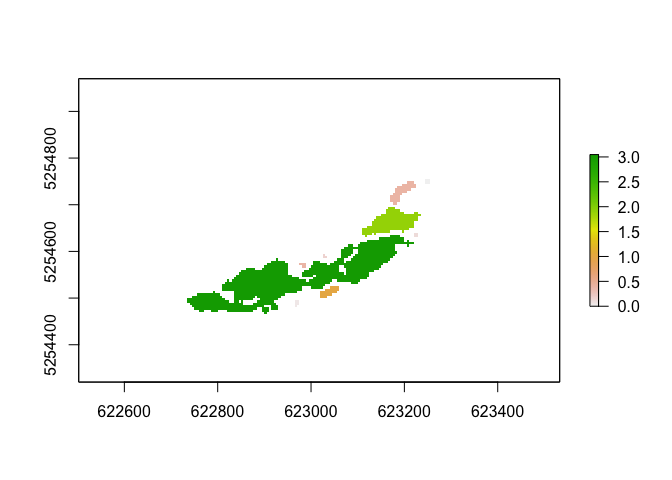
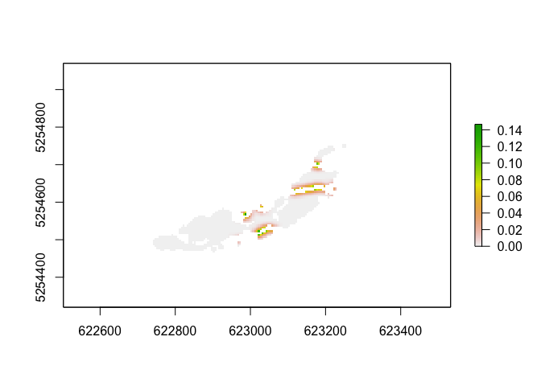
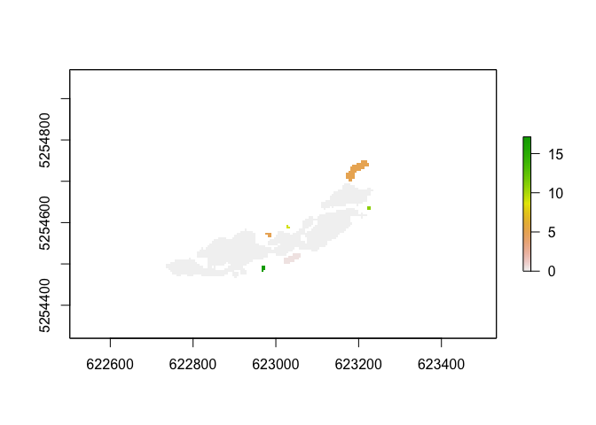

<!-- README.md is generated from README.Rmd. Please edit that file -->

# rconnect

<!-- badges: start -->
<!-- badges: end -->

rconnect is a simple package that implements riverscape connectivity
measures for quantifying the colonization potential of wind dispersed
plants species as described by Wagner & Wöllner (2023):

*effectiveSeedrain*  
*effectiveConnections*  
*effectiveDistance*  
*colonizationPotential*   
*absoluteConnections*  
*connectionCapacity*  

It further provides a helper function to create a negative exponential
dispersal kernel, functions to create a connectivity and distance matrix
based on effectiveConnections and effectiveDistance and a simple example
raster file with suitable habitats.

## Installation

You can install the current development version of rconnect from
[GitHub](https://github.com/) with:

``` r
# install.packages("devtools")
devtools::install_github("TCWagner/rconnect")
```

## Example

Here is a basic example how to work with the package and calculate
simple connectivity metrics of a riverscape.

Let’s find out how well the habitats of a riverscape (a riverine
landscape) are connected for a certain species. As example we chose the
Asteracea *Chondrilla chondrilloides*, an wind dispersed species well
adapted to open gravel bars of alpine rivers. For details about the
species ecology, dispersal and status, see Wöllner et al. 2022.

We start with a raster file, containing the suitable habitats for our
species. Suitable habitats need to have a value \> 0; 0 codes for
unsuitable habitats. Here we use our example data that comes with our
package: *habitats_lech*

``` r
library(raster)
#> Loading required package: sp
library(rconnect)

## load the example raster with suitable habitats. suitable habitats need to be coded with values > 0
## you may use your own raster, here we use our example data:
data(habitats_lech)
plot(habitats_lech)
```


Now we need the dispersal kernel for the species under consideration as
a matrix. We can create a simple, negative exponential dispersal kernel
with the function *dispersalKernel*. Assuming a negative exponential
decrease of the seeds with distance and a dispersal distance of \~14m
the decay is 0.19.

To create the kernel, we need to provide the cell size of our raster
containing the suitable habitats (5m), and the intended radius of our
kernel in cells. By default, the kernel center cell will be set to 0 and
the kernel normalized to sum up to 1.

``` r

cckernel <- dispersalKernel(cellsize=5, radius=7, decay=0.19)
#> Loading required namespace: igraph
```

Lets start to calculate the seed rain that can be exchanged between
neighboring habitats (*effectiveSeedrain*). If we do not *summarize*,
the output will be a raster with the relative contribution that each
cell of an habitat has.

``` r

eS <- effectiveSeedrain(habitats_lech, cckernel, summarize=F)
plot(eS)
```



Now, lets see how many *effective Connections* a patch has with the
other patches of the riverscape

``` r

eCM <- effectiveConnectionsMatrix(habitats_lech, cckernel)
eCM
#>              [,1]        [,2]      [,3]       [,4]       [,5]      [,6]
#>  [1,]          NA 0.005021085 0.0000000 0.00000000 0.00000000 0.0000000
#>  [2,] 0.005021085          NA 0.3773102 0.00000000 0.00000000 0.0000000
#>  [3,] 0.000000000 0.377310226        NA 0.06423960 1.45851127 0.0000000
#>  [4,] 0.000000000 0.000000000 0.0642396         NA 0.04449116 0.0000000
#>  [5,] 0.000000000 0.000000000 1.4585113 0.04449116         NA 0.1585712
#>  [6,] 0.000000000 0.000000000 0.0000000 0.00000000 0.15857125        NA
#>  [7,] 0.000000000 0.000000000 0.0000000 0.00000000 0.36850376 0.0000000
#>  [8,] 0.000000000 0.000000000 0.0000000 0.00000000 0.98020300 0.0000000
#>  [9,] 0.000000000 0.000000000 0.0000000 0.00000000 0.03742227 0.0000000
#>            [,7]     [,8]       [,9]
#>  [1,] 0.0000000 0.000000 0.00000000
#>  [2,] 0.0000000 0.000000 0.00000000
#>  [3,] 0.0000000 0.000000 0.00000000
#>  [4,] 0.0000000 0.000000 0.00000000
#>  [5,] 0.3685038 0.980203 0.03742227
#>  [6,] 0.0000000 0.000000 0.00000000
#>  [7,]        NA 0.000000 0.00000000
#>  [8,] 0.0000000       NA 0.00000000
#>  [9,] 0.0000000 0.000000         NA
```

However, if we want to have the total *effective Connections* or *eC*
that a patch has with all neighbors (that is the connections weighted by
distance) we can use:

``` r

eC <- effectiveConnections(habitats_lech, cckernel)
eC
#>   patch         eC
#> 1     1 0.00000000
#> 2     2 0.37731023
#> 3     3 1.90006110
#> 4     4 0.10873076
#> 5     5 3.04770271
#> 6     6 0.15857125
#> 7     7 0.36850376
#> 8     8 0.98020300
#> 9     9 0.03742227
```

We may want to have this a a raster file that we can use for further
modeling. So lets set *summarize* to *FALSE*:

``` r

eCr <- effectiveConnections(habitats_lech, cckernel, summarize=F)
plot(eCr)
```



Similarly, we can calculate the *effective Distance* for each patch
(*eD*):

``` r

eD <- effectiveDistance(habitats_lech, cckernel)
eD
#>   patch          eD
#> 1     1 25.12378155
#> 2     2  4.56275168
#> 3     3  0.00000000
#> 4     4 10.52994343
#> 5     5  0.00000000
#> 6     6  8.73928558
#> 7     7  4.73756397
#> 8     8  0.09489125
#> 9     9 15.59165370
```

We may wish to have your results a raster file for further analysis
instead of a simple table. No problem, we just call the respective
functions with *summarize=FALSE* option and will get a raster where each
patch is assigned the respective value:

``` r

eDr <- effectiveDistance(habitats_lech, cckernel, summarize=FALSE)
plot(eDr)
```



Finally we want a summary of our metrics and the total *colonization
Potential* of our riverscape:

``` r

cP <- colonizationPotential(habitats_lech, cckernel)
cP
#>              habitats threshold        cP   cP_rsd       eD  eDm_rsd nCm
#> 1 cc_clumped_lech_ehd         0 0.7765052 1.347085 7.708875 1.094959   2
#>     nCm_rsd       cCm  cCm_rsd
#> 1 0.8291562 0.3262841 1.007004
```

So, our riverscape has a *colonization Potential* of 0.776 (\~78%) for
*Chondrilla chondrilloides*. The average *effective Distance* a patch
has is 7.7m, clearly within the species dispersal distance. On average,
each patch has 2 connections with a capacity of 0.33. However, the
relative standard deviation of all parameters is quite high, indicating
an unequal distribution of the connectivity. Note, that the average
*effective Distance* (*eDm*) does only consider connected patches. *nCm*
gives us the average *number of Connections* a patch has, and *cCm*
tells us the average *connection Capacity* (relative amount of seeds)
that can be exchanged by a connection.

## Final Note

The basic functions of this package, *effectiveConnections* and
*effectiveSeedrain* provide spatially explicit data if needed. Though
currently we do neither consider the actual occupancy of habitats or
barriers, both can easily be combined with our functions. The respective
data can be used for further modelling. We do not include long distance
dispersal here, because here the mechanisms are different and more
complex. AA package suitable for this is currently under development.

## References

Woellner, R., Bräuchler, C., Kollmann, J., & Wagner, T. C. (2022).
Biological Flora of Central Europe: Chondrilla chondrilloides (Ard.) H.
Karst. Perspectives in Plant Ecology, Evolution and Systematics, 54,
125657.

Wagner, T. C., Woellner, R. (2023). A new set of metrics and framework 
to assess the colonization potential of riverscapes by wind-dispersed plant species. Scientific Reports 13, 20097. 
<http://dx.doi.org/10.1038/s41598-023-47477-y>
