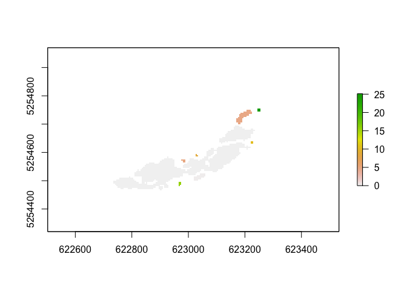

<!-- README.md is generated from README.Rmd. Please edit that file -->

# rconnect

<!-- badges: start -->
<!-- badges: end -->

rconnect is a simple package that implements riverscape connectivity
measures for wind dispersed plants as described by Wagner & Wöllner
(2022):

*absoluteConnections*  
*effectiveConnections*  
*effectiveDistance*  
*effectiveSeedrain*

It further provides a helper function to create a negative exponential
dispersal kernel, functions to create a connectivity and distance matrix
based on effectiveConnections and effectiveDistance and a simple example
raster file with suitable habitats.

## Installation

You can install the current development version of rconnect from
[GitHub](https://github.com/) with:

``` r
# install.packages("devtools")
devtools::install_github("TCWagner/rconnect")
```

## Example

Here is a basic example how to work with the package and calculate
simple connectivity metrics of a riverscape.

Let’s find out how well the habitats of a riverscape (a riverine
landscape) are connected for a certain species. As example we chose the
Asteracea *Chondrilla chondrilloides*, an wind dispersed species well
adapted to open gravel bars of alpine rivers. For details about the
species ecology, dispersal and status, see Wöllner et al. 2022.

We start with a raster file, containing the suitable habitats for our
species. Suitable habitats need to have a value \> 0; 0 codes for
unsuitable habitats. Here we use our example data that comes with our
package: *habitats_lech*

``` r
library(raster)
#> Lade nötiges Paket: sp
library(rconnect)

## load the example raster with suitable habitats. suitable habitats need to be coded with values > 0
## you may use your own raster, here we use our example data:
data(habitats_lech)
plot(habitats_lech)
```


Now we the dispersal kernel for the species under consideration as a
matrix. We can create a simple, negative exponential dispersal kernel
with the function *dispersalKernel*. Assuming a negative exponential
decrease of the seeds with distance and a dispersal distance of \~14m
the decay is 0.19.

To create the kernel, we need to provide the cell size of our raster
containing the suitable habitats (5m), and the intended radius of our
kernel in cells. By default, the kernel center cell will be set to 0 and
the kernel normalized to sum up to 1.

``` r

cckernel <- dispersalKernel(cellsize=5, radius=5, decay=0.19)
#> Lade nötigen Namensraum: igraph
```

Now we can easily calculate the number of connections (eC) that each
patch has:

``` r

nC <- absoluteConnections(habitats_lech, cckernel)
nC
#>   patch nC
#> 1     1  0
#> 2     2  1
#> 3     3  2
#> 4     4  0
#> 5     5  3
#> 6     6  1
#> 7     7  1
#> 8     8  1
#> 9     9  0
```

However, if we want to have the effective connections or *eC* (that is
the connections weighted by distance) we can use:

``` r

eC <- effectiveConnections(habitats_lech, cckernel)
eC
#>   patch        eC
#> 1     1 0.0000000
#> 2     2 0.1842729
#> 3     3 0.5721172
#> 4     4 0.0000000
#> 5     5 1.0000000
#> 6     6 0.1258424
#> 7     7 0.2991850
#> 8     8 0.5086541
#> 9     9 0.0000000
```

If we want to have the effective connectivity for our whole riverscape
we just need to calculate the mean of the effective connections:

``` r

mean(eC$eC)
#> [1] 0.2988968
```

So, our riverscape has a conectivity of \~30% for Chondrilla
chondrilloides.

We can now determine the effective distance (*eD*), a measure that tells
us, how fas away a patch would be from an …

``` r

eD <- effectiveDistance(habitats_lech, cckernel)
eD
#>   patch         eD
#> 1     1         NA
#> 2     2  4.9962768
#> 3     3  0.0000000
#> 4     4 10.9351921
#> 5     5  0.0000000
#> 6     6  8.9908412
#> 7     7  4.9482707
#> 8     8  0.4196436
#> 9     9 17.1338503
```

You may wish to have your results a a raster file for further analysis
instead of a simple table. No problem, just call the respective
functions with *summarize=FALSE* option and you will get a raster where
each patch is assigned the respective value:

``` r

eDr <- effectiveDistance(habitats_lech, cckernel, summarize=FALSE)
plot(eDr)
```



Sometimes you may wish to have the cell-by-cell connectivity, or
*effectiveSeedrain* to use for further modeling:

``` r

eCr <- effectiveSeedrain(habitats_lech, cckernel, summarize=FALSE)
plot(eCr)
```


And, finally, you may wish to have the effective patch-to-patch
connectivity and the respective effective distances between patches

``` r

eCM <- effectiveConnectionsMatrix(habitats_lech, cckernel)
eCM
#>       [,1]      [,2]      [,3] [,4]      [,5] [,6]       [,7]      [,8] [,9]
#>  [1,]   NA 0.0000000 0.0000000    0 0.0000000    0 0.00000000 0.0000000    0
#>  [2,]    0        NA 0.1842729    0 0.0000000    0 0.00000000 0.0000000    0
#>  [3,]    0 0.1430062        NA    0 0.4291111    0 0.00000000 0.0000000    0
#>  [4,]    0 0.0000000 0.0000000   NA 0.0000000    0 0.00000000 0.0000000    0
#>  [5,]    0 0.0000000 0.5933886    0        NA    0 0.06388325 0.4574982    0
#>  [6,]    0 0.0000000 0.0000000    0 0.1258424   NA 0.00000000 0.0000000    0
#>  [7,]    0 0.0000000 0.0000000    0 0.2991850    0         NA 0.0000000    0
#>  [8,]    0 0.0000000 0.0000000    0 0.5086541    0 0.00000000        NA    0
#>  [9,]    0 0.0000000 0.0000000    0 0.0000000    0 0.00000000 0.0000000   NA
```

Please note, that the effective distances for a patch cannot be summed
up or averaged to obtain its total *effectiveDistance*. Use the
appropriate function *effectiveDistance* instead.

## Finally

The basic functions of this package, *effectiveConnections* and
*effectiveSeedrain* provide spatially explicit data if needed. Though
currently we do neither consider the actual occupancy of habitats or
barriers, both can easily be combined with our functions. The respective
data can be used for further modelling. We do not include long distance
dispersal here, because here the mechanisms are different and more
complex. AA package suitable for this is currently under development.

## References

Woellner, R., Bräuchler, C., Kollmann, J., & Wagner, T. C. (2022).
Biological Flora of Central Europe: Chondrilla chondrilloides (Ard.) H.
Karst. Perspectives in Plant Ecology, Evolution and Systematics, 54,
125657.

Wagner, T. C., Woellner, R. (2022). Effective Connectivity and effective
Habitat Distance - A new metric to quantify habitat connectivity for
plant species in riverscapes. Ecological Indicators.
